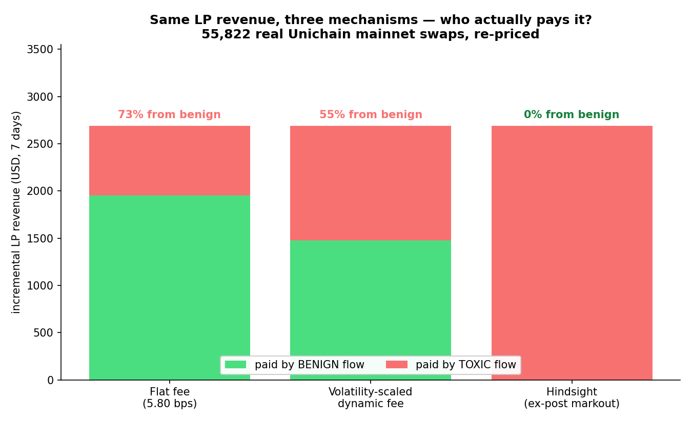
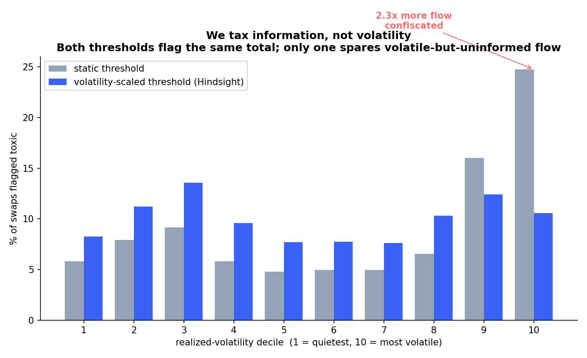
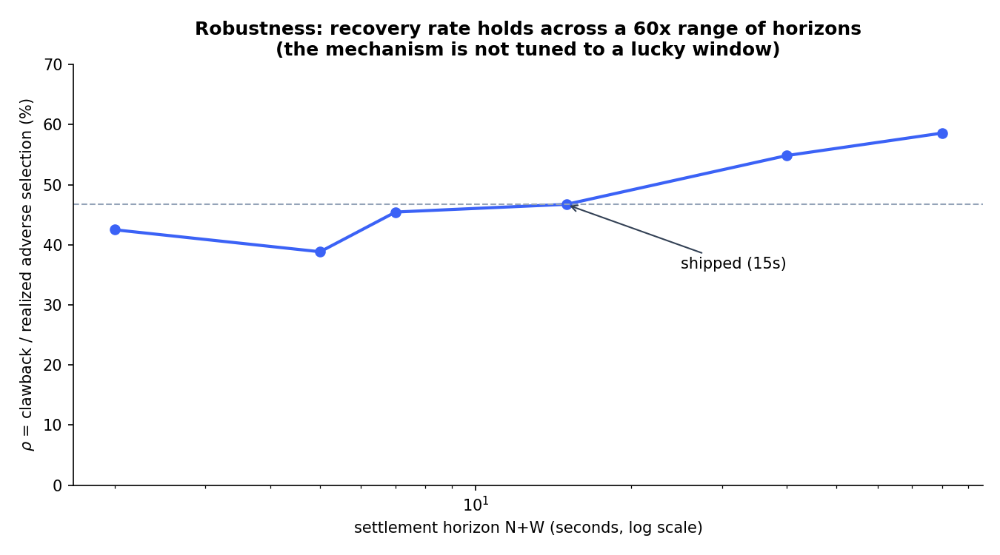

# Hindsight

[](https://github.com/OoJae/hindsight-hook/actions/workflows/ci.yml)
[](LICENSE)

**Ex-post markout-settled fees for Uniswap v4 — the fee is decided *after* your trade.**

> Every deployed MEV defense prices flow **before** it knows anything — volatility guesses, priority-fee taxes, auctions for rights. Hindsight prices flow from the one signal that cannot be faked, spoofed, or revert-spammed: **what the price actually did after your trade landed.** Benign flow is refunded to ~0. Informed flow pays its realized adverse-selection cost — streamed back to LPs.

Built for the **UHI10 Hookathon** (theme: *Sustainable Liquidity & MEV Protection*).

**🔗 Live app (Unichain Sepolia): https://oojae.github.io/hindsight-hook/**
**🔬 Interactive evidence: https://oojae.github.io/hindsight-hook/explorer/** — re-prices all
55,822 real mainnet swaps *in your browser* under any parameters you choose. Try to break it.
**Hook:** `0xC4E83D74A486C056c6164655F1d2D5ae5408d0C4` · all addresses in [`DEPLOYMENTS.md`](DEPLOYMENTS.md) — watch the real
flashblock counter tick, get a bond quote, and see live settlements incl. an actual toxic
forfeit. Connect any wallet on Unichain Sepolia to swap ("Mint demo tokens" gives you balance).

---

## The problem

LPs on volatile pairs bleed value to informed flow: CEX-DEX arbitrageurs extract loss-versus-rebalancing (LVR) every block ($233.8M measured over 19 months on mainnet, 75% of it captured by just 3 searchers). Static fees can't fix this — a 30bps fee throttles the benign flow you want while barely denting the informed flow you don't. And dynamic fees can't either: as the UHI10 organizers put it, *"a dynamic fee can't tell the difference between a retail trader and a bot — it ends up punishing everyone equally."*

The newest generation of defenses (priority-fee MEV taxes à la Angstrom L2 / Balancer v3) price the *intent* to be first. But on fast rollups searchers no longer bid for priority — they **spam cheap reverting probes** (documented on Unichain in Aug 2025; >50% of Base gas is now MEV spam paying <10% of fees). A reverted probe pays zero MEV tax. Ex-ante pricing is structurally gameable.

## The mechanism

**You can't revert-spam a measurement of what already happened.**

```
 swap ──► bond escrowed (ERC-6909 claims, afterSwapReturnDelta)
             │
             ▼   N flashblocks (~3s on Unichain, via Uniswap's official
             │   FlashblockNumber contract — 200ms granularity)
             ▼
      settlement window [F0+N, F0+N+W] finalizes ── TWAP recorded
             │
             ▼
      settle(swapId)   ← permissionless, keeper-tipped
        │
        ├─ markout ≤ θ  (price reverted / stayed)  → FULL BOND REFUND
        │                                            effective fee ≈ 5bps headline
        └─ markout > θ  (trade predicted the move) → bond forfeited pro-rata
                                                     → dripped to in-range LPs
```

- **Markout** — signed post-trade drift in tick space (1 tick ≈ 1bp), measured against a **finalized** window: the verdict is a pure read; there is nothing to sandwich at settlement.
- **θ = θ_min + k·σ**, where σ is realized volatility over the 120s *before* the trade — the toxicity threshold breathes with the tape, so trending markets don't confiscate benign momentum flow, but the trade being judged cannot manufacture its own threshold. *We tax information, not volatility.*
- **Bond** = 25bps of notional × reputation multiplier. New addresses pay full freight (discounts are **earned** through settled benign history — Sybil-proof); addresses caught extracting pay up to 3×; whales get no discount above a size tier (no reputation laundering).
- **Forfeits drip** to LPs via `donate()` on an epoch schedule, which *bounds* the atomic
  snipe rather than hand-waving it away: a JIT LP that adds, triggers one flush and exits can
  take at most **one epoch's release — 50% of the pot** (15% at the specific liquidity ratios
  in `test/integration/LPSet.t.sol`, and it scales with the JIT's share), where a lump
  donation would have handed it 100%. The drip does not *penalise* a JIT that keeps coming
  back — payout is proportional to liquidity-weighted presence at flush instants, so a JIT
  that attends every flush earns what a durable LP earns. That is the honest characterisation:
  the drip converts a single snipeable event into a stream you must keep showing up for.
- **Missing data ⇒ refund** (withholding observations can never punish a trader), but **unsettled bonds auto-forfeit after a grace period** (waiting out the observation buffer is not an escape hatch).
- Reverted transactions never land, never post bonds, never enter the measurement — the revert-spam attack that defeats ex-ante taxes simply does not apply.

## vs. the state of the art

| | prices | infrastructure | revert-spam | who pays |
|---|---|---|---|---|
| Angstrom L2 tax | ex-ante (priority tip) | off-chain validator net (L1) / tip semantics (L2) | ❌ gameable | everyone who bids |
| Balancer v3 MEV hook | ex-ante (priority tip) | none | ❌ gameable | everyone who bids |
| am-AMM (Bunni v2 †) | ex-ante (manager lease) | Harberger auction + manager | — | uniform fee |
| Dynamic/volatility fees | ex-ante (proxy guess) | oracle | — | everyone equally |
| **Hindsight** | **ex-post (realized markout)** | **none — fully on-chain, permissionless keeper** | ✅ **immune** | **only flow that measurably extracted** |

† the only am-AMM production deployment was exploited and shut down in 2025.

## Sustainable liquidity, quantified — on real mainnet flow

`backtest/` re-prices **7 days of real Unichain mainnet ETH/USDC swaps** (55,822 of them)
under each mechanism. Every number is a *re-pricing of identical realized trades* — no
simulated agents, no behavioural assumptions. Reproduce in one command:
`cd backtest && .venv/bin/python compare.py`.

### 0. We publish the null

Before any headline: does the trade-direction signal actually carry information, or would
*random* labels collect just as much? Flipping a swap's direction negates its markout, so we
shuffle directions and re-run — everything else untouched.

| horizon (N+W) | true clawback | random-label mean | z | beats |
|---|---|---|---|---|
| 1+1s | $484 | $764 | **−4.39** | 0/30 |
| 3+2s | $1,045 | $1,122 | **−1.07** | 5/30 |
| 5+2s | $1,430 | $1,350 | +1.02 | 25/30 |
| **10+5s (shipped)** | **$2,325** | $1,938 | **+4.89** | **30/30** |
| 30+10s | $4,067 | $3,190 | +9.56 | 30/30 |

**At short horizons the mechanism does not beat chance** — the dominant post-swap signal
there is a trade's own price impact, not information (large trades see price revert against
them, so random labels can collect *more*). Informational drift only separates from impact
at ~10s. We ship the horizon where the signal is real, and publish the null beside it. An
earlier draft of this README quoted the 3+2s numbers; our own second-round audit caught it.

### 1. How much of the bleeding does it stop?

| | |
|---|---|
| LP fee income (status quo, 5 bps) | $6,690.77 |
| Post-swap drift in the trade's direction (gross positive) | $5,001.53 |
| Net LP markout P&L, ex-fees (the 15s LVR bleed) | −$2,186.54 |
| **Hindsight clawback** | **$2,325.28** (net of keeper tips: **$2,209.02** to LPs) |
| **ρ = clawback ÷ gross positive markout** | **46.5%** |

ρ is deliberately measured against *gross* adverse selection, not net: the mechanism prices
each trade's own informational cost and does not credit an informed trader for the
favourable markout that uninformed flow happened to hand back. Netting the two is exactly
the pooling this hook exists to undo — but the gross/net split is in the table so you can
judge that choice yourself.

### 2. Same LP revenue — who pays it?

Calibrate a volatility-scaled dynamic fee to raise *exactly* the revenue Hindsight raises on
the same flow, then ask who hands over the incremental money:

| mechanism | benign pays | toxic pays | separation | incremental revenue from **benign** flow |
|---|---|---|---|---|
| Flat fee (6.74 bps) | 6.74 bps | 6.74 bps | 1.0× | **76.0%** |
| Volatility-scaled dynamic fee (5 + 4.27·σ) | 6.37 bps | 7.90 bps | 1.24× | **59.9%** |
| **Hindsight** | **5.00 bps** | **12.24 bps** | **2.45×** | **0.0%** |

All fees are volume-weighted — what a dollar of flow actually pays, and the same definition
the [browser explorer](https://oojae.github.io/hindsight-hook/explorer/) and `replay.py` use,
so all three agree. Given the *same* LP revenue, the best ex-ante signal available in
`beforeSwap` separates toxic from benign flow by **24%**; Hindsight separates them by **145%**,
and every benign bond comes back in full. (That 24% is up from 5% in v6 — a fairer showing
for the competitor, because v7's toxic set is better identified and a volatility fee catches
part of it. We report the number that makes our own case weaker, because it is the true one.) 

### 3. Two obvious objections, answered with data

**"Circular — you define 'toxic', then grade competitors against your own labels."** The
obvious rebuttal — correlate each mechanism's *charge* against realized markout — is a
**tautology, and we'll say so first**: our charge is a monotone function of the settlement
markout, so that test scores ~0.80 on pure Gaussian noise (higher than it scores on the real
data). It proves nothing. So we score the charge against harm it **never observed**: set the
charge on the settlement window `[t+10s, t+15s)`, then measure harm on a **disjoint later
window** `[t+20s, t+60s)`, with a shuffled-harm control. The competitor is steelmanned with a
**trailing** 120s volatility signal — what a hook can actually read in `beforeSwap`.

| mechanism | Pearson | Spearman |
|---|---|---|
| **Hindsight** | **0.441** | **0.449** |
| dynamic fee (trailing vol — fair ex-ante signal) | 0.036 | 0.007 |
| flat fee | 0.000 | 0.000 |
| *control: Hindsight vs shuffled harm* | *−0.001* | *0.002* |

Hindsight's charge predicts *future* adverse selection an order of magnitude better than a
volatility-scaled fee, and the control lands at zero exactly as it must.

**"Just one bot on a thin tape?"** The top address is half the dataset, so we removed it —
the result strengthens:

| sample | ρ | dynamic fee's take from benign |
|---|---|---|
| all 55,822 swaps | 46.5% | 59.9% |
| excluding top sender (n=27,920) | **48.1%** | 60.1% |
| excluding top-3 (n=12,128) | **53.8%** | 72.6% |

### 4. We tax information, not volatility — and we had this wrong until v7

The threshold θ scales with short-horizon realized volatility, so a violent-but-uninformed
tape is not confiscated. Through v6 we sourced that σ from the **settlement window** — the
same observations the markout is measured over. Our own live demo exposed what that costs:
the largest markout in an 8-swap arb burst was *acquitted* and a 10-tick one *convicted*,
because the burst's own companion prints landed inside the early swaps' windows and lifted
their threshold.

That is not a thin-tape curiosity. On the real 55,822-swap tape, with nobody attacking:

| | |
|---|---|
| swaps with ≥1 of their **own** sender's prints inside their own θ window | 9,154 (16.4%) |
| swaps that actually inflated their own θ | 4,195 |
| mean inflation among those | **+2.72 ticks** (max +22.4) |
| **swaps acquitted purely because of their own prints** | **927 (1.66% of all flow)** |

So we changed where σ comes from: a trailing window `[t−120s, t)` that has already closed
when the trade lands. Every number in that table becomes **zero** — not because a clamp was
tightened, but because there is nothing left for the trade to write into. The regression test
asserts the *equality* (`padding must move θ by exactly 0`), not a bound; a bound is still a
mechanism with a price on it.

We did not assume this was an improvement — we adjudicated it. Six estimators, all calibrated
to flag the **same share** so "flags more" could not pass for "classifies better", scored
against harm the mechanism never sees (a disjoint `[t+20s, t+60s)` window):

| θ estimator | Spearman(charge, FUTURE harm) | false positives on harmless flow |
|---|---|---|
| static — no vol term at all | 0.5042 | 5.6% |
| **trailing σ (v7, shipped)** | **0.5048** | **5.3%** |
| in-window σ (v6) | 0.4719 | 5.4% |

**What v6 shipped was the worst of the six.** The volatility term was never the problem;
its sourcing was. A five-second forward window is both writable by the trade being judged and
far too noisy to estimate a volatility regime.

**The honest cost.** The in-window sourcing genuinely did buy better false-positive
protection in the loudest volatility decile (7.8% vs 14.2%), and the trailing σ does *not*
reproduce that. We took the trade anyway — that protection was bought with a threshold a
trader can move, and 927 real acquittals is the receipt. `compare.py` §4 prints the decile
table on **both** volatility axes, because each estimator flatters itself on the axis that is
its own input, and the unconditioned rate (where neither can) has all three within 0.3pp.


### 5. Not tuned to a lucky window

ρ moves 31.5% → 60.6% across a 60× horizon range and the k × θ_min sensitivity grid is
smooth and monotone with no cliffs. Honest note: θ_min still dominates k on this tape (θ_min
3→12 cuts the clawback ~64%; k 0.7→5.6 cuts it ~50%). 

## Partner integrations

- **Unichain** — the mechanism is flashblock-native: settlement windows are measured on **Uniswap's official FlashblockNumber contract** (live builder-maintained proxies: mainnet [`0x3c3a…1ec3→proxy 0x3c3a8a41e095c76b03f79f70955fff3b03cf753e`], Sepolia [`0x056466f1a50a6B5e4DCCF106074ee0083D721a42`] — verified ticking at 200ms cadence). To our knowledge this is the **first v4 hook to consume it**. Graceful `block.number` fallback + owner emergency switch if builder infra ever halts; `src/OperatedFlashblockNumber.sol` mirrors the official V1 allowlist pattern as a contingency. Fork tests run the full cycle against the **real Unichain Sepolia PoolManager**.

- **Reactive Network** — **live and verified end-to-end.** An RSC on Reactive Lasna (`src/integrations/reactive/HindsightReactive.sol`, deployed `0xC971B9073E118DF50FAE99FeFa7EeEaEEe32C1fC`) subscribes to the hook's `SwapRecorded` events on Unichain Sepolia plus Cron sweep/flush topics, and drives settlement through the official callback proxy into `HindsightCallback` (`0x7d7Bf00f54648944Cafc336F357934f8F8994d76`). The current v4 deployment settles autonomously ~60s after the swap (10s maturity + 5s window + RSC latency); the first such settlement we captured a tx hash for was on the v1 bytecode, when the horizon was shorter: `0xacc2cf71beba00a94862f41aafe62d185fb93d30eabcc4d1c68db029d86b11c4` (29s). Settlement liveness without any operated infrastructure.

- **Chainlink Automation** — `src/integrations/chainlink/HindsightUpkeep.sol` deployed on Base Sepolia (`0x38dED78f1ec799C5178aC1e16821aB2aB35B6893`) against a second, chain-identical hook deployment (`0xc60C0be68D02BD38Bc8aF44cf71D157C904950c4`, running the hook's `block.number` fallback clock): three-mode conditional upkeep (settle/flush/poke), forwarder-gated, **three upkeeps registered programmatically against the live v2.3 registrar** (the web UI is deprecated to withdraw-only; we encoded the v2.3 `RegistrationParams` incl. `billingToken` by hand), auto-approved, LINK-funded, forwarders wired on-chain. This leg also proves the **fallback clock end-to-end on a chain with no flashblocks**: a live retail swap stamped at `461731830` (a `block.number × 10` stamp), `checkUpkeep(settle)` flipping false→true on-chain as the window closed, and `settle(0)` returning the full bond — tx `0x9984206868526b036a5e8bd6932063a2d3cbde1047fb01eef43cbd21b521796c`. Full transparency: Chainlink sunset classic-Automation testnet execution in mid-2026 and the Base Sepolia DON currently performs nothing for anyone (30h registry scan: zero `UpkeepPerformed` events) — so the perform path is proven by the fork suite executing the complete check→perform→refund cycle against the real Base Sepolia PoolManager (reproduce: `BASE_SEPOLIA_RPC_URL=<rpc> forge test --mc BaseSepoliaFork -vv`, ~13s; without an RPC the fork tests SKIP loudly rather than passing silently).

See `DEPLOYMENTS.md` for all addresses and proof transactions.

## Repository tour

```
src/
  HindsightHook.sol            the hook: bond escrow, observations, settlement, drip, reputation
  libraries/MarkoutLib.sol     markout + forfeit curve (pure)
  libraries/BondMathLib.sol    bond sizing: base bps × reputation, size tier, caps (pure)
  libraries/ToxicityLib.sol    per-address EMA + multiplier curve (pure)
  libraries/ObservationLib.sol flashblock-stamped ring buffer + jump-clamped TWAP
  OperatedFlashblockNumber.sol testnet counter mirroring the official V1 pattern
  mocks/MockFlashblockNumber.sol
script/                        00 counter → 01 hook (HookMiner) → 02 pool+liquidity → 03 demo flows
tools/verify_deployment.py     byte-for-byte: this source == the live hooks on both chains
bot/keeper.mjs                 poke() open windows, settle() matured swaps, flushDonations()
backtest/
  swaps_eth_usdc_5bp.csv.gz    7 days of REAL Unichain mainnet swaps (55,822), committed
  fetch.py                     rebuilds that tape from RPC (not needed to reproduce)
  replay.py                    headline stats + charts
  compare.py                   the 8-section evidence suite: null, LVR decomposition,
                               revenue-matched head-to-head, horizons, vol deciles,
                               sensitivity, out-of-sample, concentration, permutation
test/
  spike/DeltaSigns.t.sol       bond delta math across ALL FOUR swap configs
  unit/                        fuzzed library tests
  integration/                 settlement, donation drip + LP accrual, reputation
  integration/AuditRepro.t.sol      round-1 findings: one regression test each
  integration/AuditRepro2.t.sol     round-2 findings M4-M7, plus M10 found live on-chain
  integration/EvictionExploit.t.sol the round-2 critical: exploit, then closure
  invariant/                   claims exactly back pending bonds; custody == pot
  fork/UnichainSepolia.t.sol   full cycle vs the REAL PoolManager + REAL flashblock counter
```

## Run it

Measured steady-state gas (`forge test --mt test_gas_numbers -vv`): swap incl. hook + test
router ≈ 224k, settle refund ≈ 41k, settle forfeit incl. the donation drip ≈ 219k, poke ≈ 29k
— cents on an L2. (Measured after warm-up, so one-time funding/cold-storage costs are not
billed to them.)

```bash
git clone https://github.com/OoJae/hindsight-hook && cd hindsight-hook
# fast dep init (the full --recursive pulls ~1GB of unrelated nested submodules):
git submodule update --init lib/reactive-lib lib/v4-hooks-public
git -C lib/v4-hooks-public submodule update --init --recursive lib/v4-core lib/v4-periphery
git -C lib/v4-hooks-public submodule update --init lib/openzeppelin-contracts lib/solady lib/forge-std
forge test                                   # 128 tests: unit, integration, invariant
forge test --match-path 'test/fork/*'        # +5 fork tests (needs an RPC; SKIPs loudly without one)
forge test --mc UnichainSepoliaFork -vv      # fork suite vs real Unichain Sepolia state
forge test --gas-report
python3 tools/verify_deployment.py          # proves this source IS the live bytecode

# backtest on real mainnet swaps — the tape is COMMITTED (swaps_*.csv.gz), so this
# reproduces every published number offline, with no RPC and no fetch step
cd backtest && python3 -m venv .venv && .venv/bin/pip install matplotlib
.venv/bin/python compare.py                  # every number in "Sustainable liquidity, quantified"
.venv/bin/python replay.py                   # headline stats + charts
.venv/bin/python fetch.py 7                  # (optional) rebuild the tape from RPC yourself

# deploy (Unichain Sepolia)
cp .env.example .env                         # fill PRIVATE_KEY
forge script script/01_DeployHook.s.sol --rpc-url $UNICHAIN_SEPOLIA_RPC_URL --broadcast
forge script script/02_CreatePoolAddLiquidity.s.sol --rpc-url $UNICHAIN_SEPOLIA_RPC_URL --broadcast
cd bot && npm i && npm start                 # keeper: poke/settle/flush
```

## Security posture

- Hook permission bits validated against implementation (`Hooks.validateHookPermissions`)
- `settle()` opens its own `unlock` — cannot be reentered from inside any swap (v4 lock)
- Callback authenticated to the PoolManager; verdicts computed only from finalized windows
- **θ cannot be moved by the trade it prices.** It is measured over `[exec−600, exec−1]` — a
  window that has already closed when the swap lands — and is snapshotted into the swap record
  at execution, so nothing afterwards can move it. The regression test asserts that padding
  the settlement window changes θ by *exactly zero*. Through v6, θ came from the settlement
  window itself, and 927 real swaps on the mainnet tape were acquitted by their own companion
  prints (§4). Absent trailing data leaves θ at its floor — fail-shut, deliberately: failing
  open would let a trader wait out a quiet period and be acquitted unconditionally.
- **θ's volatility input is clamped harder than the TWAP's** (10 ticks vs 60). The two clamps
  defend opposite parties: the TWAP's loose clamp protects the *trader* from a manipulated
  settlement price, while θ's tight clamp protects the *LPs*. This mattered more when θ was
  writable by the trade; it is retained as defence in depth.
- TWAP: time-weighted with per-observation jump clamping; bond capped at the linearized cost of moving the pool by the toxicity threshold (`bond ≤ κ·L_active·θ`) so manipulation is never +EV — thin pools degrade toward a plain low-fee pool; range-exiting fills pay the standard bond (max realized price move = max markout exposure)
- Rounding: forfeits round down, refunds get the remainder (trader-favoring on dust)
- Invariant-tested: escrowed claims ≡ pending bonds; hook custody ≡ donation pot
- **The refund follows the money.** `hookData` is attacker-controlled, so it is honoured only
  when the named beneficiary *is* `tx.origin`, or when a whitelisted router vouches for a user
  via `IMsgSender`. Everything else refunds to `tx.origin`. An earlier version paid the
  hookData address unconditionally, which let any solver or frontend that builds the calldata
  skim the bond of a user who signed the transaction — the bond is withheld from the swap's
  own output, so it is never the calldata author's money. The same version paid `sender` when
  hookData was empty, stranding refunds inside routers whose call had long since ended. Both
  are closed and regression-tested (round-2 audit M5).
  *Known limitation:* for a relayed smart-contract-wallet swap, `tx.origin` is the relayer.
  That path must register as a trusted router implementing `IMsgSender` — which is the same
  requirement that already gets it proper reputation attribution.
- **Reputation cannot be moved by a third party.** It is read/written only for authenticated
  flow. Unauthenticated flow pays the full default bond and is reputation-neutral, so a fresh
  address buys nothing. (`tx.origin` is used as "who signed this transaction", never as an
  authorization grant.)
- **Owner powers are bounded, including over time.** `setParams` is read at settle time, so it
  is retroactive over in-flight bonds. The bounds are what make that safe: keeper tip ≤ 10%,
  `grace ≥ window`, `theta/ramp ≥ 1`, bond ≤ 100bps, `θ_min ≤ 1000` (so the mechanism cannot
  be switched off), and — new in v5 — **the settlement deadline `maturity + window + grace`
  may only ever move later.** Without that ratchet the owner could collapse the deadline to
  two stamps and auto-forfeit every escrowed bond at 100%, bypassing θ and the ramp entirely;
  the test that claimed to disprove this asserted `assertGe(unsigned, 0)` and was vacuously
  true (round-2 audit M6). Ownership is 2-step transferable and is an explicit constructor
  argument (hooks are deployed via the CREATE2 factory, so `msg.sender` would be the factory).
- **Waiting does not pay better than working.** A grace lapse and an evicted window both
  forfeit the full bond, so tipping the keeper on those branches made *waiting* pay 20× more
  than settling a benign bond promptly. The tip is now suppressed on any ungraded forfeit:
  prompt settlement weakly dominates for every swap, and the lapsed bond still goes to LPs in
  full (round-2 audit M7).
- **Batch settlement is fault-isolated**: each id settles behind an external self-call with a
  gas stipend, so one hostile beneficiary cannot stall the Chainlink/Reactive lanes.

### Audit
A multi-agent adversarial audit (4 attack lanes + independent verification of every finding)
was run against this codebase **twice**, and every surviving finding has an executable repro
committed *before* its fix, in `test/integration/AuditRepro.t.sol`,
`test/integration/AuditRepro2.t.sol` and `test/integration/EvictionExploit.t.sol`.

Round 1's fixes are v3; two of its four headline claims did not reproduce under our own repro
tests and were **dropped rather than "fixed"**. Round 2 found eight more, including a critical
(buffer eviction let a toxic trade buy a full refund), a silent 25 bps skim by anyone building
the calldata, and an owner retune that could confiscate every in-flight bond. A ninth came
from neither audit — we found it by *running* the thing: a stalled keeper lane auto-forfeited
five swaps whose verdicts had already been finalized benign. All are tabulated with their
fixes in `DEPLOYMENTS.md`.

The tenth is the one worth reading. Round 2's M9 pointed out that our own live demo inverted
the pitch — largest markout acquitted, smaller ones convicted — because θ and the markout
shared a window. v6 *bounded* that. When we went back to remove it properly, the measurement
said something harder to hear: the volatility term as we had sourced it was **making the
classifier worse**, and 927 real swaps on the mainnet tape had been acquitted by their own
companion prints. §4 has the full adjudication, including the one axis on which the old
version still wins. Fixed at the root in v7, and asserted as an equality rather than a bound.

## Future work

- Production router with `IMsgSender` attribution and bond-aware `minAmountOut` (the demo router is v4-core's `PoolSwapTest` + `hookData` beneficiary passthrough, which the hook's `IMsgSender` fallback also supports)
- ~~Decouple θ's volatility window from the markout window~~ — **done in v7** (see §4). The
  concern that a lagged pre-trade window would have no data after a quiet period, collapsing
  θ to its floor, was worth taking seriously; measured incidence is **2.9%** of swaps, and
  that failure direction is the safe one (an adversary who could empty their trailing window
  gets a *lower* threshold, not a free pass). θ is now at its floor for 2.9% of swaps rather
  than 68.2% — the term is finally active for nearly every trade instead of one in three.
- Recover the top-decile false-positive protection that the trailing σ gives up (§4). A
  longer or regime-aware lookback is the obvious candidate; the 30s–1800s sweep in
  `compare.py` moved it very little, so this likely needs a different estimator, not a
  different window length.
- Time-weighted **median** settlement TWAP (current: jump-clamped time-weighted average)
- Cross-pool portable reputation via an attested registry; fast-lane flat-fee opt-out

## Status & provenance

Built during the UHI10 hookathon window (new code; scaffolding follows the UHI course's
v4 patterns — `Uniswap/v4-hooks-public` — credited here per the originality rules).
